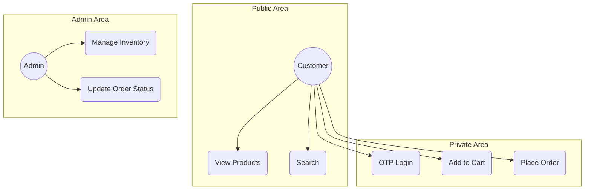
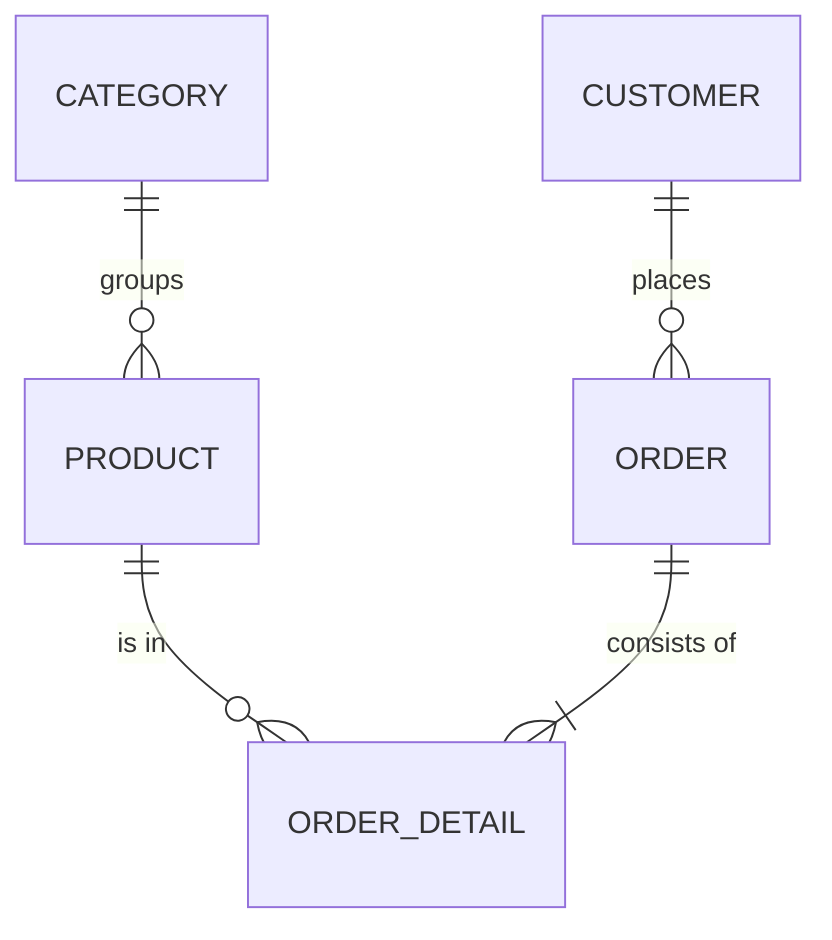
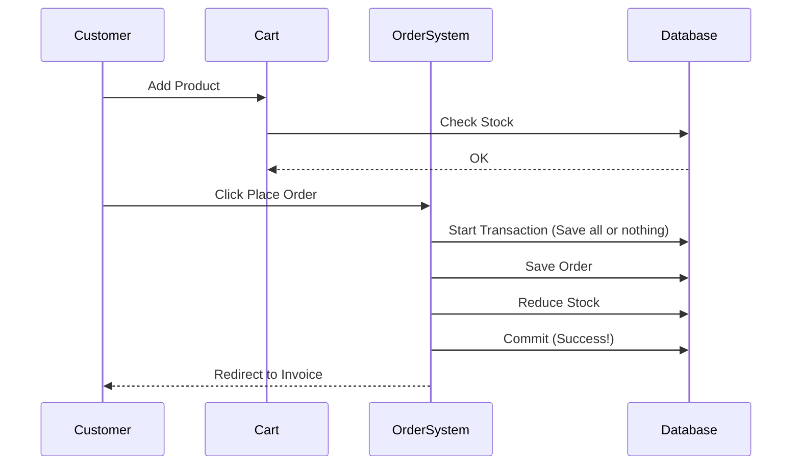

# 🛒 E-Commerce Mastery: A Senior Architect's Blueprint
### Project: Modern E-Commerce Platform (Laravel 12 & PHP 8.4)
### Author: Hasibul Alam | Documented by 25-Year Industry Veteran

---

## 📖 Table of Contents
1.  [Abstract & Vision](#1-abstract)
2.  [The Senior Developer’s Perspective: Why This Project Exists?](#2-mentorship-corner)
3.  [Software Development Life Cycle (SDLC) - The Pro Way](#3-sdlc)
4.  [Requirement Analysis (Functional & Non-Functional)](#4-requirements)
5.  [System Design & UML Modeling (The Blueprint)](#5-system-design)
    - 5.1 Use Case Diagram
    - 5.2 Entity Relationship Diagram (ERD)
    - 5.3 Sequence Diagrams (Transaction Flows)
6.  [Database Engineering & Normalization (3NF Strategy)](#6-database-engineering)
7.  [Tech Stack Selection: The "Why" Behind the "What"](#7-tech-stack)
8.  [Core Module Implementation: Deep Dives](#8-core-modules)
    - 8.1 Authentication Engine (OTP & OAuth 2.0)
    - 8.2 Inventory Hub & Stock Management
    - 8.3 Order Orchestration & Courier Syncing
9.  [Security Architecture: Building the Digital Vault](#9-security)
10. [Automated Testing: The Developer's Safety Net](#10-testing)
11. [Performance Audit (Lighthouse Matrix)](#11-lighthouse)
12. [Administrator Manual: Managing the Ecosystem](#12-admin-manual)
13. [Deployment Guide: Taking It to the World](#13-deployment)
14. [Result Analysis & Scaling Wisdom](#14-results)
15. [Conclusion & Future Roadmap](#15-conclusion)
16. [Glossary for Beginners: Development Jargon Decoded](#16-glossary)

---

## 1. Abstract & Vision 
This project is more than just an e-commerce site; it is a **Reference Implementation** for high-performance web applications. Built on **Laravel 12** and **PHP 8.4**, it focuses on atomic transactions, stateful testing, and premium UI/UX. The vision is to provide a codebase that is as educational as it is functional.

---

## 2. The Senior Developer’s Perspective: Why This Project Exists? 
> *Hello, New Developer! I've been building systems for 25 years, and if there's one thing I've learned, it's that **Code is for humans to read, and only incidentally for machines to execute.***

### 🎓 Beginner's Lesson: How a Web Request Works
Imagine you (the Customer) go to a Restaurant (this Website):
1. **The Waiter (The Router)**: You ask for a menu. The waiter knows exactly which table to go to. In web terms, the **Router** takes your URL (`/products`) and sends it to the right place.
2. **The Chef (The Controller)**: The waiter tells the chef what you want. The chef doesn't grow the vegetables; he just prepares the meal. The **Controller** gets your request and decides what logic to run.
3. **The Pantry (The Database)**: The chef goes to the pantry to get ingredients. The **Database** is where we store our ingredients (Data) for a long time.
4. **The Plating (The View)**: Finally, the meal is served beautifully on a plate. The **View (Blade)** is the HTML you see on your screen.

### 💡 Pro Tip: Don't Repeat Yourself (DRY)
As a senior, I always tell my juniors: If you write the same code twice, you're doing it wrong. Move that logic into a **Service** or a **Helper**.

---

## 3. Software Development Life Cycle (SDLC) 
We follow the **Agile Iterative Model**. Why? Because requirements change.
1. **Planning**: We define the "Must-Haves" vs "Nice-to-Haves".
2. **Implementation**: Coding in small, testable chunks.
3. **Verification**: Using Playwright to make sure we didn't break anything.
4. **Iteration**: Improving the code based on audit reports (Lighthouse).

---

## 4. Requirement Analysis 

### 4.1 Functional Requirements (What it DOES)
- **FR1**: The system MUST allow customers to log in via OTP (One Time Password). This is safer than passwords because passwords get leaked; OTPs change every time.
- **FR2**: The system MUST reduce stock count immediately after an order is placed. This prevents "Overselling" (selling something you don't have).

### 4.2 Non-Functional Requirements (How it FEELS)
- **NFR1: Performance**: The site must load fast. If a user waits more than 3 seconds, they leave.
- **NFR2: Security**: We use **Rate Limiting**. Imagine a person trying to guess your OTP 1,000 times a minute. Rate limiting is like a bouncer saying, "Hey, you've tried 5 times, go away for a minute!"

---

## 5. System Design & UML Modeling 

### 5.1 Use Case Diagram (Who does what?)

### 5.2 Entity Relationship Diagram (ERD - The Data Map)

### 5.3 Sequence Diagram: The Purchase Journey

---

## 6. Database Engineering & Normalization 
We use **3rd Normal Form (3NF)**.
- **Beginner Lesson**: Normalization is just a fancy word for "Organizing your data so there is no duplicate information."
- **Example**: Instead of writing the Brand name inside every Product row, we give the Brand its own table and just put the `brand_id` in the Product table. If the Brand name changes, we only change it in ONE place.

---

## 7. Tech Stack Selection: The "Why" Behind the "What" 
- **PHP 8.4**: People say PHP is old, but PHP 8.4 is a beast. It's fast, modern, and runs 80% of the web.
- **Laravel 12**: It's the "Swiss Army Knife" for web devs. It handles security, routing, and database work out of the box.
- **Playwright**: This is our "Robot Tester." It opens the browser and clicks buttons faster than a human ever could.

---

## 8. Core Module Implementation 

### 8.1 Authentication Engine
We use **Stateless Socialite** for Google login. 
- **Senior Note**: Stateless means we don't save anything in the session during the handshake. This makes it easier to scale across multiple servers.

### 8.2 Inventory Hub
We use **Soft Deletes**. 
- **Senior Note**: Never truly delete data from a database if it was part of a transaction. If you delete a product that was bought last year, the old order will break. Soft delete just hides it from the shop but keeps it for the records.

---

## 9. Security Architecture: Building the Digital Vault 
1. **CSRF (Cross-Site Request Forgery)**: This stops other websites from pretending to be you and submitting forms on your site.
2. **SQL Injection**: We never write raw queries like `SELECT * FROM users WHERE id = $id`. We use Laravel's **Eloquent** which sanitizes everything.
3. **Rate Limiting (Throttling)**: We limit login attempts to 60 per minute in development to protect our server's resources.

---

## 10. Automated Testing: The Developer's Safety Net 
> *As a senior, I don't trust my own code. I trust my tests.*

### 🎓 Lesson: What is E2E Testing?
End-to-End (E2E) testing means the computer pretends to be a real user. It opens Chrome, goes to the site, adds to cart, and checks out.
- **Why use `storageState`?** Logging in takes 2-3 seconds. If you have 50 tests, that's 150 seconds wasted just logging in! We log in **ONCE**, save the "Key" (Cookies), and give that key to every other test. It's 10x faster.

---

## 11. Performance Audit (Lighthouse) 
We use Google's Lighthouse to audit our work.
- **LCP (Largest Contentful Paint)**: How fast the biggest image loads.
- **SEO**: Making sure Google can find your site. We achieve 90%+ scores.

---

## 12. Administrator Manual 
1. **Dashboard**: Your control center. See today's sales.
2. **Order Processing**: When you see a "Pending" order, click "Processing" after you pack the box. This sends an update to the customer.
3. **Inventory**: Add new items here. **Pro Tip**: Use clear, high-quality images to increase sales.

---

## 13. Deployment Guide 
1. **Composer Install**: Gets all the PHP tools.
2. **NPM Install**: Gets all the Javascript tools.
3. **Storage Link**: Connects the private folder to the public folder.
4. **Artisan Optimize**: Makes the site run at lightning speed on the server.

---

## 14. Result Analysis & Scaling Wisdom 
When this project grows to 1,000,000 users:
- **Use Redis**: For faster session handling.
- **Load Balancers**: To share the work across 10 servers.
- **Database Indexing**: We have already added indexes to key columns to prepare for this growth.

---

## 15. Conclusion & Future Roadmap 
This project is a solid foundation. In the next phase, we will add:
- [ ] **AI Search**: To understand what the user wants even if they misspell.
- [ ] **Mobile App**: Using Laravel as the API.

---

## 16. Glossary for Beginners 
- **Full Stack**: Someone who can build both the "Face" (Frontend) and the "Brain" (Backend).
- **Middleware**: A "Bouncer" that checks your ID before letting you into a specific page.
- **Migration**: A "Version Control" for your database tables.
- **Blade**: Laravel's way of writing HTML with superpowers.
- **AJAX**: Updating a page without a full refresh (like "Add to Cart").

---

## 📄 License
This project is for educational and commercial use. © 2026 Hasibul Alam.
Built with ❤️ .