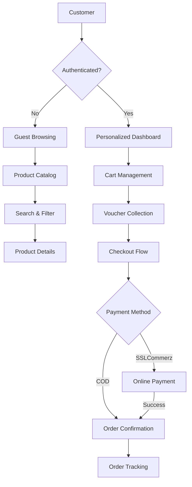

# Capital Shop - Premium E-Commerce Ecosystem

[](https://laravel.com)
[](https://www.php.net/)
[](https://playwright.dev/)
[](https://developers.google.com/web/tools/lighthouse)

**Capital Shop** is a high-performance, enterprise-grade e-commerce platform engineered with Laravel 12. It features a custom-built authentication system, robust voucher management, and a seamless shopping experience, all validated through a rigorous E2E and UI/UX testing suite using Playwright and Lighthouse.

---

## 🏗️ System Architecture & Logic

The platform follows a clean **MVC (Model-View-Controller)** pattern, enhanced with **Service Layers** to handle complex business logic (like voucher application and SSLCommerz integration).

### Core Logic Flow


---

## 🚀 Key Features

### 💎 Customer Experience
- **Secure Authentication**: Custom-built auth system with OTP verification and 2FA support.
- **Social Integration**: One-click login via Google OAuth (Stateless implementation).
- **Voucher Ecosystem**: "Collect-to-Wallet" voucher system with AJAX-based real-time collection.
- **Interactive Shopping**: persistent cart, wishlist, and dynamic product reviews.
- **Premium UI**: Modern, responsive design using Bootstrap 5 and smooth micro-animations via Toastr.js.

### 🛡️ Administrative Power
- **Metric Dashboard**: Real-time sales analytics and inventory monitoring.
- **Resource Management**: Full CRUD for Products, Categories, Brands, and Banners.
- **Order Fulfillment**: Advanced order status tracking and Steadfast Courier integration.
- **System Control**: Comprehensive settings management including SSLCommerz sandbox toggle.

---

## 🛠️ Technology Stack

### Backend Infrastructure
- **Framework**: Laravel 12.x (LTS Ready)
- **Database**: MySQL 8.0 (InnoDb, ACID Compliant)
- **Security**: Custom Auth, CSRF Protection, SQL Injection Prevention (Eloquent), XSS Filtering.
- **Integration**: SSLCommerz (Payment Gateway), Steadfast (Courier), Google Socialite.

### Frontend Excellence
- **Engine**: Blade Templating (66.2% of codebase)
- **Styling**: Vanilla CSS + Bootstrap 5 (Custom Theming)
- **Interactions**: jQuery, Axios, Toastr.js
- **Build Tool**: Vite (Asset Bundling & HMR)

---

## 🧪 Testing & Quality Assurance

We maintain code quality through a dual-testing strategy:

### 1. E2E Functional Testing (Playwright)
Validates critical user journeys across Chromium, Firefox, and Webkit.
- **Search Flow**: Verified product indexing and retrieval.
- **Cart Lifecycle**: Persistent storage and item management.
- **Navigation**: Link integrity and route authorization.

### 2. UI/UX Auditing (Lighthouse)
Automated performance and accessibility audits integrated directly into the test suite.
- **Performance**: Optimized asset delivery and DOM size.
- **Accessibility**: ARIA compliance and color contrast verification.
- **Best Practices**: Security headers and HTTPS checks.
- **SEO**: Meta-tag integrity and semantic HTML structure.

#### Latest Audit Results:
| Metric | Homepage | Product List |
| :--- | :--- | :--- |
| **Performance** | 25 | 93 |
| **Accessibility** | 73 | 81 |
| **Best Practices** | 96 | 96 |
| **SEO** | 83 | 92 |

---

## 📥 Installation & Setup

### Prerequisites
- PHP 8.3+
- MySQL 8.0+
- Composer 2.x
- Node.js 18+ & NPM

### Step-by-Step Setup

1. **Clone & Install**
   ```bash
   git clone https://github.com/HASIBULALAMH/e-commerce.git
   cd e-commerce
   composer install
   npm install
   ```

2. **Environment Configuration**
   ```bash
   cp .env.example .env
   php artisan key:generate
   ```

3. **Database Initialization**
   ```bash
   php artisan migrate --seed
   php artisan storage:link
   ```

4. **Compile Assets**
   ```bash
   npm run build
   ```

5. **Start Development**
   ```bash
   php artisan serve
   # In another terminal
   npm run dev
   ```

---

## 🚦 Running Tests

To execute the full testing suite:

**Run Functional E2E Tests:**
```bash
npm run test:e2e
```

**Run UI/UX Lighthouse Audits:**
```bash
npm run test:audit
```

**View Detailed Reports:**
```bash
npx playwright show-report
```

---

## 👨‍💻 Contributing

As a junior developer working on this e-commerce project, I follow strict coding standards:
- Follow [PSR-12](https://www.php-fig.org/psr/psr-12/) coding standards.
- All new features must include Playwright test coverage.
- Use meaningful commit messages.

---

## 📄 License

This project is licensed under the MIT License - see the [LICENSE](LICENSE) file for details.