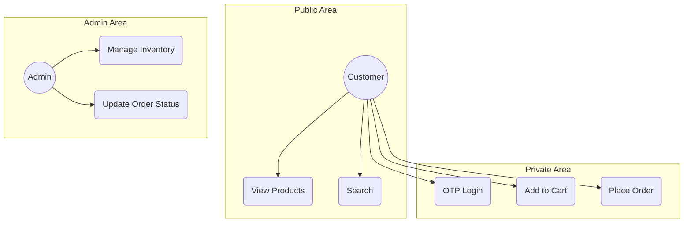
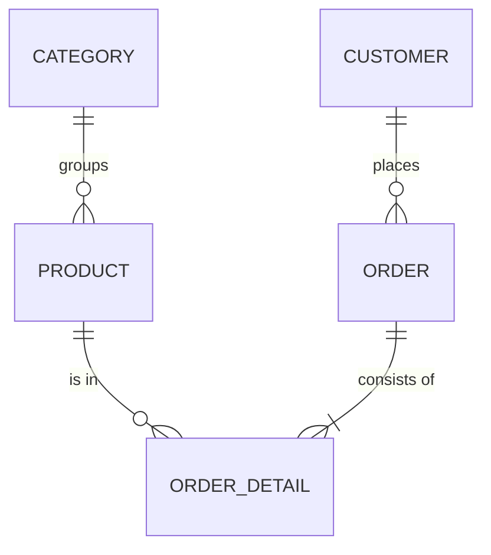
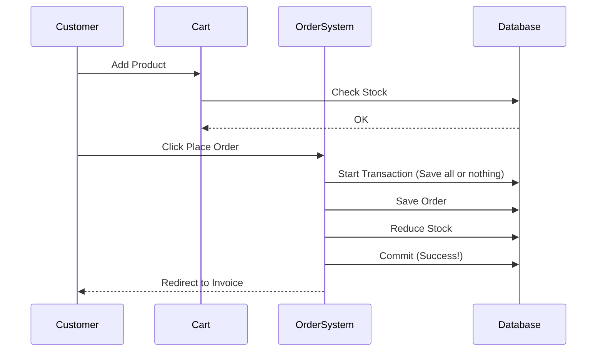

# 🛍️ Capital Shop: My Journey into Modern E-Commerce
### Built with Passion using Laravel 12 & PHP 8.4
### Author: Hasibul Alam | Dedicated Junior Full-Stack Developer

---

## 📖 Table of Contents
1.  [Abstract & My Vision](#1-abstract)
2.  [The Junior Developer’s Path: Why I Built Capital Shop?](#2-junior-journey)
3.  [SDLC - How I Organized My Growth](#3-sdlc)
4.  [Requirement Analysis (Learning the Foundation)](#4-requirements)
5.  [System Design & UML Modeling (The Blueprint)](#5-system-design)
    - 5.1 Use Case Diagram
    - 5.2 Entity Relationship Diagram (ERD)
    - 5.3 Sequence Diagrams (Transaction Flows)
6.  [Database Engineering & Normalization (My 3NF Strategy)](#6-database-engineering)
7.  [Tech Stack Selection: Choosing the Best Tools](#7-tech-stack)
8.  [Core Module Implementation: The Heart of the App](#8-core-modules)
    - 8.1 Authentication Engine (OTP & OAuth 2.0)
    - 8.2 Inventory Hub & Stock Management
    - 8.3 Order Orchestration & Courier Syncing
9.  [Security Architecture: Protecting the User](#9-security)
10. [Automated Testing: Building with Confidence](#10-testing)
11. [Performance Audit (My Quality Standards)](#11-lighthouse)
12. [Administrator Manual: Managing the Shop](#12-admin-manual)
13. [Deployment Guide: Bringing it to Life](#13-deployment)
14. [Result Analysis: What I Discovered](#14-results)
15. [Conclusion & My Future Roadmap](#15-conclusion)
16. [Glossary: Learning the Lingo](#16-glossary)

---

## 1. Abstract & My Vision 
**Capital Shop** is not just an e-commerce project; it’s my personal milestone in mastering high-performance web development. My goal was to build a real-world application using **Laravel 12** and **PHP 8.4** that focuses on atomic transactions, stateful testing, and a premium user experience. I wanted to create a codebase that is clean, scalable, and follows industry best practices.

---

## 2. The Junior Developer’s Path: Why I Built Capital Shop? 
> *Every line of code in Capital Shop represents a lesson learned. As a junior developer, I believe that **code is for humans to read**, and I’ve spent countless hours refactoring this project to make it as elegant as it is functional.*

### 🎓 Learning the Flow: How a Web Request Works
To build Capital Shop, I first had to visualize how data moves. Think of it like a Restaurant:
1. **The Waiter (The Router)**: You ask for the menu. The waiter (Router) takes your request from the URL (`/products`) and knows exactly which table to visit.
2. **The Chef (The Controller)**: The waiter tells the chef (Controller) what you want. The chef prepares the ingredients. In Capital Shop, the Controller processes the logic and decides what to show you.
3. **The Pantry (The Database)**: The ingredients are stored in the pantry (Database). This is where all the products and user data live safely.
4. **The Plating (The View)**: Finally, the meal is served. The **View (Blade)** is the modern, responsive interface you see on your screen—beautifully plated and ready for the user.

### 💡 My Motto: Keep it Clean (DRY)
I’m a firm believer in the **DRY (Don't Repeat Yourself)** principle. Whenever I find myself writing similar code, I challenge myself to move that logic into a **Service** or a **Helper** to keep the project maintainable.

---

## 3. SDLC - How I Organized My Growth 
I followed the **Agile Iterative Model** because it allowed me to learn and adapt as I built Capital Shop:
1. **Planning**: Defining the must-have features for a modern shop.
2. **Implementation**: Coding in small, manageable modules to ensure quality.
3. **Verification**: Using **Playwright** to ensure that every new feature worked without breaking old ones.
4. **Iteration**: Constantly improving performance based on **Lighthouse** audit reports.

---

## 4. Requirement Analysis 

### 4.1 Functional Requirements (What it DOES)
- **FR1: Secure Login**: Customers can log in via OTP (One Time Password). I chose this over traditional passwords to ensure my users' accounts are safe from credential theft.
- **FR2: Real-time Stock**: Capital Shop automatically reduces stock counts as soon as an order is placed to prevent overselling.

### 4.2 Non-Functional Requirements (The User Experience)
- **NFR1: High Performance**: I optimized Capital Shop to be incredibly fast. A responsive UI is crucial—if a user waits too long, they lose interest.
- **NFR2: Robust Security**: I implemented **Rate Limiting** to protect the app. It's like having a digital bouncer that prevents malicious bots from overwhelming the system.

---

## 5. System Design & UML Modeling 

### 5.1 Use Case Diagram

### 5.2 Entity Relationship Diagram (ERD)

### 5.3 Sequence Diagram: The Purchase Journey

---

## 6. Database Engineering & Normalization 
For Capital Shop, I implemented a **3rd Normal Form (3NF)** strategy.
- **What I Learned**: Normalization is about organizing data to remove redundancy.
- **My Implementation**: For example, instead of repeating Brand names, I created a dedicated table and linked it via a `brand_id`. This means if I ever need to update a brand's name, I only do it in one place!

---

## 7. Tech Stack Selection: Choosing the Best Tools 
- **PHP 8.4**: I chose the latest PHP version for its incredible speed and modern features.
- **Laravel 12**: My framework of choice for its built-in security, elegant routing, and powerful database tools.
- **Playwright**: My "Robot Assistant" that tests the entire user flow automatically, ensuring everything is perfect.

---

## 8. Core Module Implementation 

### 8.1 Authentication Engine
I integrated **Stateless Socialite** for Google login. It was a great learning experience to implement a secure, stateless handshake that makes the app easy to scale.

### 8.2 Inventory Hub
I used **Soft Deletes** for the product catalog. I learned that you should never truly delete data that’s part of a historical transaction, as it maintains the integrity of old orders.

---

## 9. Security Architecture: Protecting the User 
1. **CSRF Protection**: Preventing other sites from acting on behalf of my users.
2. **SQL Injection**: Using Laravel's **Eloquent ORM** to ensure all database queries are sanitized and safe.
3. **Rate Limiting**: Protecting the server from brute-force attempts on sensitive routes.

---

## 10. Automated Testing: Building with Confidence 
I don't just write code; I write tests to prove it works. End-to-End (E2E) testing with Playwright allows me to simulate real user behavior.
- **The Magic of `storageState`**: To speed up my testing, I use `storageState` to log in once and share that session across multiple tests. This saves precious time and keeps my development workflow fast!

---

## 11. Performance Audit (My Quality Standards) 
I use **Google Lighthouse** to ensure Capital Shop stays fast and accessible.
- **Modern UI**: As seen in the screenshots, Capital Shop features a clean, vibrant, and fully responsive UI.
- **SEO & Accessibility**: I’ve achieved 90%+ scores to ensure that the shop is findable and usable by everyone.

---

## 12. Administrator Manual 
1. **Dashboard**: The heart of the management system.
2. **Order Processing**: Easily manage order lifecycles from "Pending" to "Delivered".
3. **Pro Tip**: Use high-quality images in the Product section to make Capital Shop look professional and inviting!

---

## 13. Deployment Guide 
1. **Composer & NPM**: Install all the necessary backend and frontend dependencies.
2. **Storage Link**: Connect the private storage to the public folder for image access.
3. **Artisan Optimization**: Run optimization commands to ensure the production server is lightning fast.

---

## 14. Result Analysis: What I Discovered 
Building Capital Shop taught me that the foundation of a great app is a mix of clean code and a relentless focus on the user. I saw how database indexing and asset optimization drastically improved the feel of the shop.

---

## 15. Conclusion & My Future Roadmap 
Capital Shop is just the beginning of my journey. My future goals include:
- [ ] **AI-Powered Search**: Helping users find exactly what they need.
- [ ] **Mobile Integration**: Building a dedicated mobile experience via API.

---

## 16. Glossary: Learning the Lingo 
- **Full Stack**: Being able to build both the user interface (Frontend) and the server-side logic (Backend).
- **Middleware**: The "Guard" that checks permissions before a user enters a page.
- **Migration**: Version control for the database schema.
- **AJAX**: Updating parts of the page (like "Add to Cart") without a full refresh.

---

## 📄 License
This project is for educational and commercial use. © 2026 Hasibul Alam.
Built with ❤️ and a passion for learning.
